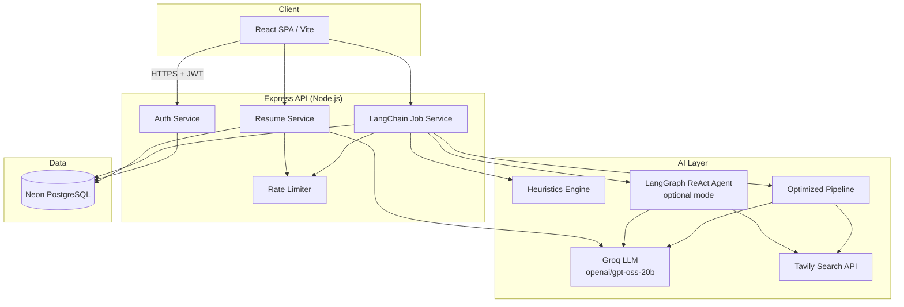
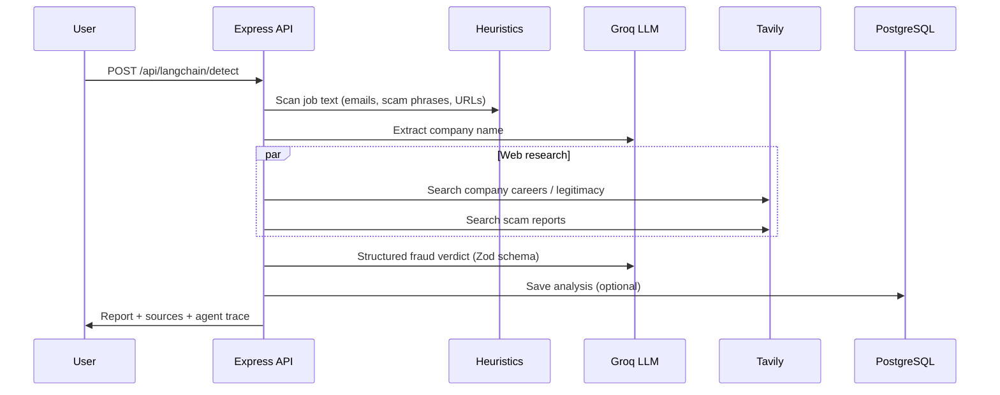

# Fake Job Detector

Production-oriented web platform that helps job seekers **detect fraudulent job postings**, **analyze resumes for ATS readiness**, and **match resumes to job descriptions** before applying.

The system combines deterministic heuristics, Groq LLM reasoning, Tavily web research, and structured JSON outputs behind a secure JWT-authenticated API.

---

## Core Features

| Module | Capability |
|--------|------------|
| **Job Fraud Analyzer** | Heuristic pre-scan + web evidence + structured risk verdict (`legitimate`, `suspicious`, `likely_scam`) |
| **Resume Studio** | Save multiple resumes, ATS quality analysis, keyword gaps, improvement suggestions |
| **Job–Resume Match** | Fit score, apply recommendation, missing skills, tailored resume edits, scam-aware job notes |
| **History** | Persisted job analyses and resume match history per user |
| **Auth** | Register, login, JWT-protected dashboard |

---

## Architecture

### High-level system design



### Job fraud detection pipeline

Default mode: **`GROQ_JOB_MODE=pipeline`** (token-efficient, better for Groq rate limits).



Optional mode: **`GROQ_JOB_MODE=agent`** uses a LangGraph ReAct agent with a `web_search` tool and structured final output.

---

## Tech Stack

### Frontend

| Technology | Purpose |
|------------|---------|
| **React 19** | UI framework |
| **Vite 8** | Dev server and production build |
| **React Router 7** | Client-side routing |
| **Tailwind CSS 4** | Styling |
| **shadcn/ui + Base UI** | Accessible component primitives |
| **Axios** | HTTP client with JWT interceptor |
| **Lucide React** | Icons |

### Backend

| Technology | Purpose |
|------------|---------|
| **Node.js + Express 5** | REST API |
| **Groq (`@langchain/groq`)** | Fast LLM inference |
| **LangChain Core** | Prompts, structured output, tool bindings |
| **LangGraph** | Optional ReAct agent orchestration |
| **Tavily (`@tavily/core`)** | Real-time web search for verification |
| **Zod** | Structured response schemas |
| **Neon Serverless Postgres** | Managed PostgreSQL |
| **Drizzle ORM** | Type-safe queries (users) + raw SQL migrations |
| **bcrypt + jsonwebtoken** | Password hashing and JWT auth |
| **express-rate-limit** | Abuse protection on AI endpoints |

### Infrastructure & integrations

| Service | Role |
|---------|------|
| **Neon** | PostgreSQL hosting (pooled connection recommended) |
| **Groq Cloud** | LLM API (`openai/gpt-oss-20b` default) |
| **Tavily** | Job/company web research |

---

## Project Structure

```text
Fake-job-detector/
├── frontend/
│   ├── src/
│   │   ├── components/
│   │   │   ├── job-detector/     # Job fraud UI
│   │   │   ├── resume/           # Resume Studio UI
│   │   │   └── ui/               # shadcn components
│   │   ├── context/              # Auth context
│   │   ├── lib/api.js            # Axios + JWT
│   │   └── pages/                # Home, Login, Dashboard
│   └── .env                      # VITE_API_URL
│
├── backend/
│   ├── index.js                  # App entry, migrations, routes
│   ├── scripts/
│   │   ├── migrate.js            # Run DB migrations
│   │   └── test-db.js            # Connection smoke test
│   └── src/
│       ├── auth-service/         # JWT auth
│       ├── database/             # Neon client, migrations, config
│       ├── Langchain-service/    # Job fraud AI pipeline
│       │   ├── agents/           # LangGraph agent (optional)
│       │   ├── services/         # Pipeline, heuristics, retry
│       │   └── schemas/          # Zod job analysis schema
│       ├── resume-service/       # Resume AI + CRUD
│       └── repositories/         # Data access layer
│
└── README.md
```

---

## Database Schema

| Table | Description |
|-------|-------------|
| `users` | Accounts (name, email, hashed password, role) |
| `job_analyses` | Saved fraud analysis reports per user |
| `resumes` | User resume text, primary flag, last ATS analysis |
| `resume_job_matches` | Resume vs job fit reports and scores |

Run migrations:

```bash
cd backend
npm run migrate
```

---

## API Overview

Base URL: `http://localhost:5000/api`

### Auth

| Method | Endpoint | Auth | Description |
|--------|----------|------|-------------|
| POST | `/auth/register` | No | Create account |
| POST | `/auth/login` | No | Login, returns JWT |
| GET | `/auth/me` | Yes | Current user profile |

### Job fraud detection

| Method | Endpoint | Auth | Description |
|--------|----------|------|-------------|
| POST | `/langchain/detect` | Yes | Main job fraud analysis |
| POST | `/langchain/search` | Yes | Alias of detect |
| GET | `/langchain/history` | Yes | Recent job analyses |

### Resume

| Method | Endpoint | Auth | Description |
|--------|----------|------|-------------|
| GET | `/resumes` | Yes | List resumes |
| POST | `/resumes` | Yes | Create resume |
| PUT | `/resumes/:id` | Yes | Update resume |
| DELETE | `/resumes/:id` | Yes | Delete resume |
| POST | `/resumes/:id/analyze` | Yes | ATS / quality analysis |
| POST | `/resumes/match` | Yes | Match resume to job description |
| GET | `/resumes/matches/history` | Yes | Match history |

### Health

| Method | Endpoint | Description |
|--------|----------|-------------|
| GET | `/health` | API status + database connectivity flag |

---

## Environment Variables

Copy `backend/.env.example` to `backend/.env` and fill in values.

| Variable | Required | Description |
|----------|----------|-------------|
| `DATABASE_URL` | Yes | Neon pooled PostgreSQL connection string |
| `SECRET_KEY` | Yes | JWT signing secret (use a long random value in production) |
| `GROQ_API_KEY` | Yes | Groq API key |
| `TAVILY_API_KEY` | Yes | Tavily search API key |
| `CLIENT_URL` | Yes | Frontend origin for CORS (e.g. `http://localhost:5173`) |
| `PORT` | No | API port (default `5000`) |
| `GROQ_MODEL` | No | Default LLM (recommended: `openai/gpt-oss-20b`) |
| `GROQ_AGENT_MODEL` | No | Model for LangGraph agent mode |
| `GROQ_JOB_MODE` | No | `pipeline` (default) or `agent` |

Frontend (`frontend/.env`):

```env
VITE_API_URL=http://localhost:5000/api
```

---

## Getting Started

### Prerequisites

- Node.js 18+
- Neon PostgreSQL database
- Groq API key
- Tavily API key

### 1. Backend

```bash
cd backend
npm install
cp .env.example .env
# Edit .env with your keys and DATABASE_URL
npm run test:db
npm run migrate
npm run dev
```

### 2. Frontend

```bash
cd frontend
npm install
npm run dev
```

Open **http://localhost:5173**, register, and use the dashboard.

---

## Production Considerations

- **Secrets**: Never commit `.env`. Rotate keys if exposed.
- **JWT**: Use a strong `SECRET_KEY` and HTTPS in production.
- **Database**: Use Neon **pooled** connection strings; run `npm run migrate` on deploy.
- **Rate limits**: AI routes use `express-rate-limit`; tune limits per tier.
- **Groq quotas**: Prefer `GROQ_JOB_MODE=pipeline` on free tier; automatic retry on 429 is built in.
- **CORS**: Set `CLIENT_URL` to your production frontend domain.
- **Build frontend**: `cd frontend && npm run build` — serve static assets via CDN or reverse proxy.
- **Process manager**: Run API with PM2, Docker, or a PaaS (Railway, Render, Fly.io).

---

## Scripts Reference

| Command | Location | Description |
|---------|----------|-------------|
| `npm run dev` | backend / frontend | Development server |
| `npm run migrate` | backend | Apply SQL migrations |
| `npm run test:db` | backend | Verify Neon connection |
| `npm run build` | frontend | Production build |

---

## License

ISC (backend package default). Update as needed for your deployment.
